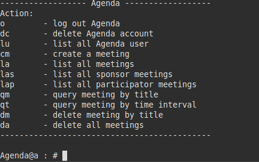

## IMPLEMENT CODES for SYSU SS TRNG 2014 - Agenda Terminal Version

It is a simple implement of Agenda, which locates in [https://github.com/ss14agenda/Agenda](https://github.com/ss14agenda/Agenda). It is a simple and boring cpp project, the official introdution to this project is as follow:

>开发一个基于命令行的议程管理系统。系统需提供用户登录，新用户注册，已注册用户登陆后用户可以注销(delete)当前用户账户，查询(query)用户名单，也可以添加(add)、删除(delete)、查询(query)系统中记录的会议安排等管理功能。在这个案例中，学生将利用面向对象程序的设计和实现技术，按用户需求对整个程序框架进行设计和实现，并逐步完成基本和扩展功能。通过此项目来让参训学生掌握在Linux环境下进行代码编写、程序调试和测试的基本知识，让学生初步了解面向对象编程的过程、设计模式的作用、UML图的含义，加强学生的对C++编程能力等技能。      
>小规模：Line of Code(1k,2k)

But the design of this project, called [Three-Tier](https://en.wikipedia.org/wiki/Multitier_architecture#Three-tier_architecture), may worth for learning for the code beginner. Besides, some C++11 features used in this project also worth for learning, such as lambda, function template, etc.     
I took a whole day to implement this boring project just in order to overcome the nightmare back in to the year I was a freshman. So, **feel free to use all of the implement code and I hope this can help you in your freshman summer code training in SS of SYSU.**      

### How to run

Make sure you have installed g++ and it should support c\+\+11

```sh
make
./Agenda
```

### UI



